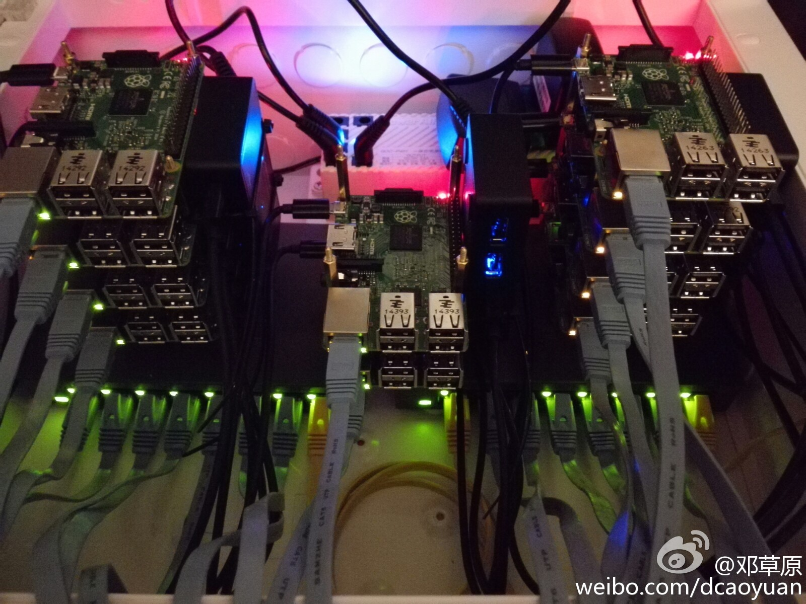
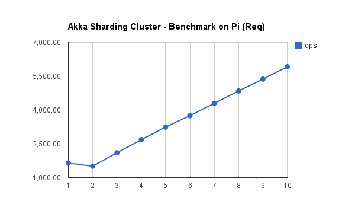
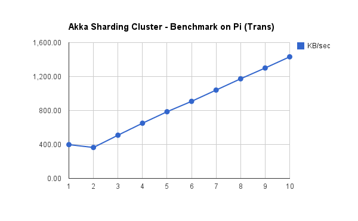

Akka 分片集群水平扩展能力分析
============================================

跟很多分片集群解决方案不同，akka 分片集群（sharding cluster）中每一个节点都在直接访问本地数据的同时，也都可以作为 proxy 访问集群中其它节点的数据。在我看来，这是 akka 分片集群水平扩展（scale-out）能力可能接近线性的关键。

测试
-------

在采用树莓派 2 组成的 10 个节点的集群中，我用 astore 测试了 akka 分片的水平扩展能力，结果显示出非常好的线性。我们不妨在此做个简单的分析。

估算
-----------

设 c 为连接数，\ :math:`\tau` 为平均响应时间，则单节点时 qps 为：

:math:`qps = c \left(\frac{1}{\tau}\right)`

当节点数为 n 时，数据有 \ :math:`\frac{1}{n}` 的概率在本节点，而 \ :math:`\frac{n-1}{n}` 的概率在其它节点。假设在本节点的平均响应时间仍然为 \ :math:`\tau_1`，在其它节点的则为 \ :math:`\tau_2`，则总体的平均响应时间为：

:math:`\tau=\frac{\tau_1 + (n-1)\tau_2}{n}`

这时，qps 为：

:math:`qps 
= cn \left(\frac{1}{\tau}\right)
= cn \left(\frac{1}{\frac{\tau_1 + (n-1)\tau_2}{n}}\right)
= cn \left(\frac{n}{\tau_1 + (n-1)\tau_2}\right)
= cn \left(\frac{n}{\tau_2n - (\tau_2-\tau_1)}\right)`

当 \ :math:`(\tau_2-\tau_1)` 随着 n 的增加而越来越小于 \ :math:`\tau_2n` 时，我们可以开始忽略 \ :math:`(\tau_2-\tau_1)` 项，也即：

:math:`qps 
\propto cn\left(\frac{n}{\tau_2n}\right)
\propto cn\left(\frac{1}{\tau_2}\right)
\propto n`

验证
--------------

下面我们看看几个测试中实际的数据：

连接数 \ :math:`c=100`

单节点时，平均响应时间 \ :math:`\tau=0.06s`，则：

:math:`qps = 100 \left(\frac{1}{0.06}\right) = 1667`

多节点情况下，假设 \ :math:`\tau_1=0.06s` 不变，根据测试数据可以估算出 \ :math:`\tau_2=0.180s` 左右，则：

:math:`qps=100n \left(\frac{n}{0.18n - 0.12}\right)`

从这个公式可以看出，当 n 逐渐增大时，\ :math:`0.18n - 0.12` 中的 \ :math:`0.18n` 比重很快上升，当 n = 7 时，\ :math:`0.18n=1.26`，已经是 0.12 的 10 倍，

那么这个公式是否真的有效呢？我计算了 n 从 2 到 10 的数据，跟实测数据很接近：

+----+------+------+
|  n | 估算 | 实测 |
+====+======+======+
|  1 | 1667 | 1643 |
+----+------+------+
|  2 | 1667 | 1505 |
+----+------+------+
|  3 | 2143 | 2102 |
+----+------+------+
|  4 | 2667 | 2685 |
+----+------+------+
|  5 | 3205 | 3243 |
+----+------+------+
|  6 | 3750 | 3749 |
+----+------+------+
|  7 | 4298 | 4297 |
+----+------+------+
|  8 | 4848 | 4846 |
+----+------+------+
|  9 | 5400 | 5370 |
+----+------+------+
| 10 | 5952 | 5920 |
+----+------+------+

